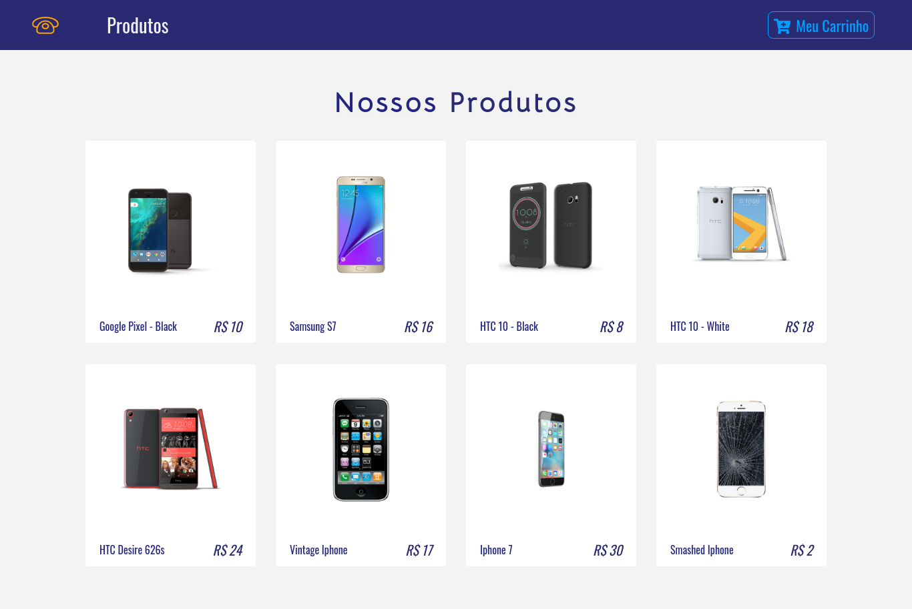

# PROJETO E-COMMERCE REACT
> Desenvolvi este projeto com o objetivo de aprender sobre o framework ReactJS.
> React / React Router / Bootstrap / Styled Components

<p> Para rodar o projeto localmente, clone este repositório. </p>
<p> ```npm install``` </p>
<p> ```npm start``` </p>
<p>o projeto estará disponível em ``` http://localhost:3000/ ``` </p>
## Linkedin

Gabriel Gonçalves Bastos – https://www.linkedin.com/in/gabriel-goncalves-bastos/

